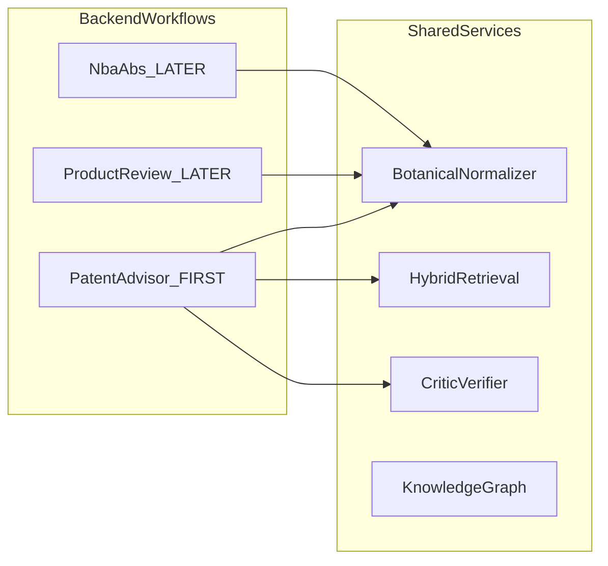
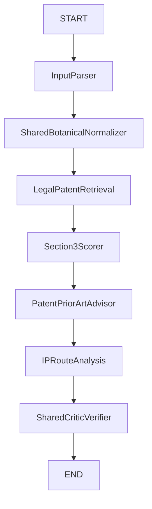

# AyurDisha — Backend: Patent Advisor First

**Overview:** Greenfield AyurDisha backend. Shared services first, then Section 3 & Patent Advisor (with domestic/international `legal_scope` switch). Product Review and NBA/ABS deferred. No frontend this tranche.

**Also saved as:** [`LANGGRAPH_PHASE_1-3_PLAN.md`](LANGGRAPH_PHASE_1-3_PLAN.md) · Cursor plan `langgraph_phase_1-3`

## Todos (this tranche)

- [x] Phase 1: Reconfirm repo inventory (backend only; no frontend work)
- [x] Phase 2: Shared config, LLM, models/state/prompts + `legal_scope` switch types
- [x] Phase 3: Shared Botanical Normalizer (+ mock KG)
- [x] Phase 4: Shared retrieval abstraction with jurisdiction/`legal_scope` filters (+ mock)
- [x] Phase 5: Shared Critic Verifier
- [x] Phase 6: Patent Advisor graph (Section 3, prior art, IP routes, risk indicator)
- [x] Phase 6: `POST /api/v1/patent-advisor` FastAPI endpoint (backend only)
- [x] Phase 6: Tests for shared components + Patent Advisor (no paid API)

---

## Direction changes (this update)

1. **Build Section 3 & Patent Advisor first** — before Product Review and before NBA/ABS.
2. **Legal international switch** — backend request/state field that flips analysis between domestic and international legal scope.
3. **Backend only for now** — FastAPI + LangGraph; no Next.js / dashboard work in this tranche.

---

## Architecture

**Framing:** Three modular LangGraph workflows powered by shared botanical normalization, hybrid retrieval, knowledge-graph, and source-verification services.

**Not:** One fixed 5-agent pipeline. Botanical Normalizer and Critic Verifier remain **shared backend services**, not user-facing features.



| Workflow | Graph | Endpoint | This tranche |
|----------|--------|----------|----------------|
| Section 3 & Patent Advisor | `graph/patent_advisor_graph.py` | `POST /api/v1/patent-advisor` | **Yes** |
| Product Review | `graph/product_review_graph.py` | `POST /api/v1/product-review` | Later |
| NBA / ABS | `graph/nba_abs_graph.py` | `POST /api/v1/nba-abs` | Later |

---

## Legal international switch

**Chosen design (concrete):**

Request + graph state include:

- `jurisdiction: str` — primary domestic jurisdiction (default `"india"`)
- `legal_scope: "domestic" | "international"` — the switch

| `legal_scope` | Behavior |
|---------------|----------|
| `domestic` | Retrieve and reason only under `jurisdiction` primary sources (e.g. Indian Patents Act Section 3) |
| `international` | Prefer international / comparative IP sources in retrieval filters + prompts; still cite only retrieved evidence; if corpus has no international hits → `HUMAN_REVIEW_REQUIRED` / insufficient evidence — **never invent foreign law** |

Example Patent Advisor request:

```json
{
  "product": "...",
  "ingredients": ["Ashwagandha"],
  "language": "en",
  "jurisdiction": "india",
  "legal_scope": "domestic"
}
```

International mode:

```json
{
  "product": "...",
  "ingredients": ["Ashwagandha"],
  "language": "en",
  "jurisdiction": "india",
  "legal_scope": "international"
}
```

Retrieval mock fixtures must be tagged with `jurisdiction` / `legal_scope` metadata so the switch is testable without live Qdrant.

---

## Phase 1 findings (unchanged scaffold)

| Item | Status |
|------|--------|
| [`app/`](../app/) uv project, Python 3.10 | Exists |
| FastAPI / LangGraph / LangChain / Gemini deps | Declared only |
| [`app/main.py`](../app/main.py) | Empty |
| LLM / Qdrant / Neo4j / BM25 code | **Missing** |
| Frontend | **Missing** — intentionally out of scope now |
| Reusable | Stack choice only |

---

## Implementation order

| Phase | Scope | This tranche |
|-------|--------|----------------|
| 1 | Inspect repo | Yes |
| 2 | Shared config / models / state / prompts + `legal_scope` | Yes |
| 3 | Shared Botanical Normalizer | Yes |
| 4 | Shared retrieval (mock + scope filters) | Yes |
| 5 | Shared Critic Verifier | Yes |
| 6 | **Patent Advisor graph + API** | **Yes** |
| 7 | Product Review graph | **Later** |
| 8 | NBA / ABS graph | Later |
| 9–10 | Real Qdrant / Neo4j | Later |
| 11–12 | Deterministic scoring polish, retry/escalation edges | Partial in Patent Advisor (risk weights + verifier status); full retry loop later |
| 13 | Remaining FastAPI endpoints | Product Review / NBA later |
| 14 | Frontend (3 cards + international switch UI) | **Out of scope this tranche** |
| 15–16 | Broader tests / metrics | Progressive |

**Stop after:** shared foundation + Patent Advisor graph + `POST /api/v1/patent-advisor` + tests.

---

## Patent Advisor workflow (Feature 2)



Responsibilities:

- Analyze Section 3 with explicit attention to **3(d), 3(e), 3(p)** where evidence supports it
- Retrieve supporting legal (+ international when `legal_scope=international`) sources
- Prior-art / patent-information analysis from retrieved evidence only
- **Patentability Risk Indicator** (rule-based configurable weights) — **not** “probability of patent approval”
- Suggest IP pathways where appropriate: Patent, Trademark, Design, Trade Secret
- Shared Critic Verifier strips unsupported claims; escalate on ambiguity / missing evidence

Deterministic Section 3 risk layer in Python:

```text
risk = 0
if 3(d) triggered: risk += weight_d
if 3(e) triggered: risk += weight_e
if 3(p) triggered: risk += weight_p
```

---

## Package layout (this tranche under `app/`)

```
app/
  config.py
  llm/provider.py
  main.py                          # FastAPI app + patent-advisor route only
  graph/
    models.py                      # includes LegalScope, patent models
    state.py                       # PatentAdvisorState
    prompts.py
    shared/
      botanical.py
      verifier.py
      input_parser.py
    patent_advisor/
      section3.py
      prior_art.py
      ip_routes.py
      risk.py                      # deterministic risk indicator
    patent_advisor_graph.py
  retrieval/
    base.py                        # filters: jurisdiction, legal_scope
    mock.py
  knowledge_graph/
    base.py
    mock.py
  api/
    patent_advisor.py              # POST /api/v1/patent-advisor
  tests/
    test_botanical.py
    test_verifier.py
    test_section3_risk.py
    test_patent_advisor_graph.py
    test_patent_advisor_api.py
    test_legal_scope_filter.py
```

**Explicitly not created yet:** `product_review_graph.py`, `nba_abs_graph.py`, frontend.

---

## Shared services (Phases 3–5)

Same contracts as before: botanical (no silent guess on ambiguity), hybrid retrieval protocol with full `RetrievedSource` metadata, critic verifier (`SUPPORTED` / `PARTIALLY_SUPPORTED` / `UNSUPPORTED`), human-escalation status fields.

Wording: “source-grounded verification” / “unsupported claims are rejected or escalated” — not “zero hallucinations.”

---

## Safety

- Decision support, not legal advice
- No fabricated statutes, foreign law, or URLs
- International switch never invents comparative law when fixtures/corpus are empty
- Distinguish FACT FROM SOURCE / MODEL INTERPRETATION / CALCULATION / UNCERTAINTY

---

## When approved — build order

1. Phase 1 inventory note in delivery report
2. Config + LLM + models (`legal_scope`) + `PatentAdvisorState` + prompts
3. Mock KG + botanical + tests
4. Mock retrieval with scope filters + tests
5. Shared verifier + tests
6. Patent Advisor nodes + graph + risk calculator + tests
7. FastAPI `POST /api/v1/patent-advisor` + API test
8. Report: files changed, tests, failures, remaining (Product Review, NBA/ABS, real infra, frontend)

**Next gate after this tranche:** Product Review backend (former Phase 7), still backend-only unless you ask for UI.
