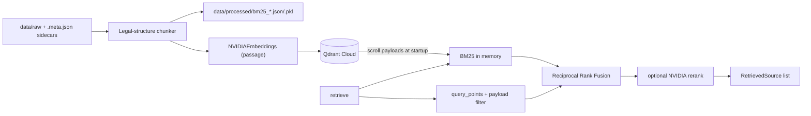

# AyurDisha Retrieval Guide — Qdrant Cloud + BM25 Hybrid

Real document retrieval for the Patent Advisor graph. The graph is unchanged; it
receives a `LegalRetriever` chosen by `RETRIEVER_BACKEND`:

| Backend | What it does |
|---------|--------------|
| `mock` (default) | In-memory `[TEST FIXTURE]` corpus (`retrieval/mock.py`). Tests use this. |
| `qdrant` | Qdrant dense search (NVIDIA embeddings) + BM25 keyword search, fused with Reciprocal Rank Fusion, optional NVIDIA reranking. |

> **The system is not using real legal data until you add source documents to
> `app/data/raw/` and run ingestion.** The only bundled documents are test fixtures
> under `app/tests/fixtures/ingest_raw/`.

All commands below run from `app/`.

---

## 1. Architecture



| File | Role |
|------|------|
| `ingest/documents.py` | Sidecar metadata, PDF (pypdf) / HTML (BeautifulSoup) / text / patent JSON parsing |
| `ingest/chunking.py` | Statute clause, guideline paragraph, patent abstract/claim chunking; stable IDs |
| `ingest/build_index.py` | Embed → create collection → upsert → persist BM25 |
| `retrieval/chunks.py` | `CanonicalChunk` — payload schema that reconstructs `RetrievedSource` |
| `retrieval/qdrant_client_factory.py` | Local/cloud client + config validation |
| `retrieval/bm25_index.py` | `BM25Store` (BM25Okapi + explicit position→ID mapping) |
| `retrieval/qdrant_hybrid.py` | `QdrantHybridRetriever`, `reciprocal_rank_fusion`, payload filters |
| `retrieval/rerank.py` | Optional `NvidiaReranker` |
| `retrieval/factory.py` | `get_retriever(settings)` |
| `knowledge_graph/factory.py` | `get_knowledge_graph(settings)` (mock; no Neo4j) |

---

## 2. Install dependencies

```powershell
cd app
uv sync
```

Added: `qdrant-client`, `rank-bm25`, `pypdf`, `beautifulsoup4` (`langchain-nvidia-ai-endpoints` was
already present). `requirements.txt` mirrors them for pip users.

---

## 3. Environment variables

Copy `app/.env.example` to `app/.env` and fill in secrets. Never commit `.env`.

| Variable | Default | Purpose |
|----------|---------|---------|
| `RETRIEVER_BACKEND` | `mock` | `mock` or `qdrant` |
| `QDRANT_MODE` | `local` | `cloud` (Qdrant Cloud / any remote Qdrant) or `local` (embedded, offline) |
| `QDRANT_URL` | — | Required when `QDRANT_MODE=cloud`, e.g. `https://<cluster>.cloud.qdrant.io:6333` |
| `QDRANT_API_KEY` | — | Required when `QDRANT_MODE=cloud` |
| `QDRANT_PATH` | `./qdrant_data` | Embedded DB directory (local mode only; git-ignored) |
| `QDRANT_COLLECTION` | `ayurdisha_legal` | Use e.g. `ayurdisha_legal_dev` for dev, `ayurdisha_legal` for prod |
| `NVIDIA_API_KEY` | — | Required for embeddings (and the reranker) |
| `EMBEDDING_MODEL` | `nvidia/nemotron-3-embed-1b` | Vector size is probed from the model at ingestion |
| `RERANK_MODEL` | `nvidia/llama-nemotron-rerank-vl-1b-v2` | Used only when `RERANKER_ENABLED=true` |
| `RERANKER_ENABLED` | `false` | Optional reranking of the top fused candidates |
| `BM25_SOURCE` | `qdrant` | `qdrant` = rebuild BM25 from collection payloads at startup; `file` = load `BM25_DIR` |
| `BM25_DIR` | `./data/processed` | BM25 artifacts written by ingestion |
| `RRF_K` | `60` | RRF constant |
| `DENSE_CANDIDATES` / `BM25_CANDIDATES` / `RERANK_CANDIDATES` | `30` / `30` / `20` | Candidate pool sizes |

> **Model note:** the originally specified `nvidia/nv-embedqa-e5-v5` (HTTP 410, end of
> life 2026-08-25) and `nvidia/nv-rerankqa-mistral-4b-v3` (HTTP 404) are no longer served
> by NVIDIA. The defaults above were verified live. If a model is retired later,
> set `EMBEDDING_MODEL` / `RERANK_MODEL`; changing the embedding model requires
> re-ingesting with `--recreate` (vector size may change).

Secrets are never logged; `Settings.redacted()` masks keys for diagnostics.

Minimal Qdrant Cloud `.env`:

```dotenv
NVIDIA_API_KEY=nvapi-...
RETRIEVER_BACKEND=qdrant
QDRANT_MODE=cloud
QDRANT_URL=https://<cluster-id>.<region>.cloud.qdrant.io:6333
QDRANT_API_KEY=<qdrant-cloud-api-key>
QDRANT_COLLECTION=ayurdisha_legal_dev
```

Get the URL and create an API key in the Qdrant Cloud console
(Cluster → *API Keys*). Prefer a key scoped to the cluster.

---

## 4. Adding source documents

Place files in `app/data/raw/` (sub-folders allowed). **Every file needs a sidecar**
`<name>.meta.json` next to it; files without one are skipped with a warning.
Metadata is never guessed.

```json
{
  "doc_id": "india_patents_act_1970",
  "title": "The Patents Act, 1970",
  "source_type": "statute",
  "source_url": "https://<official-source-url>",
  "effective_date": "<as published by the source>",
  "jurisdiction": "india",
  "legal_scope": "domestic",
  "section_prefix": null,
  "is_fixture": false
}
```

| Field | Notes |
|-------|-------|
| `doc_id` | lowercase snake_case; prefix of every chunk ID |
| `source_type` | `statute`, `guideline`, `patent`, `comparative_ip` |
| `legal_scope` | `domestic` or `international`. **Never mark Indian law as international.** |
| `jurisdiction` | e.g. `india`, `epo`, `uspto`, `wipo` (lower-cased automatically) |
| `section_prefix` | statutes only: section number if the file holds one section body without an `N.` heading |
| `is_fixture` | defaults to `false` for real documents |

Supported inputs: `.pdf`, `.html`/`.htm`, `.txt`/`.md`, and for `source_type=patent`
a `.json` list or `.jsonl` of records:

```json
[{"publication_number": "IN123456", "title": "...", "abstract": "...",
  "first_claim": "1. A composition ...", "url": "https://...",
  "publication_date": "2021-01-01", "jurisdiction": "india"}]
```

### Chunking rules (stable, deterministic IDs)

| Source type | Chunks | Example ID |
|-------------|--------|------------|
| `statute` | One chunk per clause at line start `(d)`, including its Explanation; section preamble separately | `india_patents_act_1970_3_d` |
| `guideline` / `comparative_ip` | Heading + paragraph groups (≤ ~1500 chars, paragraphs never split) | `ipo_tk_guidelines_p004` |
| `patent` | Abstract + first claim | `patent_in123456_abstract`, `patent_in123456_claim_1` |

Statute clause detection accepts `(x)` markers in increasing letter order. Roman-looking
markers `(i)`, `(v)`, `(x)` count as top-level clauses only when they are the next letter in
sequence (e.g. `(i)` directly after `(h)`) and are not followed by `(ii)`, so nested
`(i)/(ii)` lists stay with their clause even before clause (i). A clause whose body is only an
omission marker (e.g. `[Omitted]`, `* * *`) produces **no chunk** (logged), so an omitted 3(g)
never becomes an active provision. Check chunk output for new statutes before ingesting (§6).

### Corpus priorities and licensing

1. Indian Patents Act Section 3 (official text)
2. IPO guidelines on traditional knowledge / biological material
3. Relevant patent abstracts
4. Comparative IP sources (`legal_scope=international`)

Download specific documents deliberately; do not scrape sites indiscriminately.
Record `source_url` and `effective_date` exactly as published. Only commit raw files
to Git if their license permits redistribution (`data/raw/` is tracked; add private
files to `.gitignore` or keep them outside the repo and pass `--raw-dir`).

---

## 5. Running ingestion

Ingestion is offline — never during API requests.

```powershell
cd app
uv run python -m ingest.build_index --recreate
```

Options:

```text
--raw-dir DIR        default ./data/raw
--processed-dir DIR  default BM25_DIR (./data/processed)
--collection NAME    default QDRANT_COLLECTION
--recreate           drop + recreate the collection (use for full rebuilds)
--batch-size N       embedding batch size (default 32)
```

What it does: parse → chunk → probe embedding dimension → create collection
(`VectorParams(size=<probed>, distance=COSINE)`) → keyword payload indexes on
`jurisdiction`, `legal_scope`, `source_type` → batched `embed_documents` (passage mode)
→ `upsert` with deterministic UUIDv5 point IDs → write BM25 artifacts.

Without `--recreate`, points are upserted (same IDs overwrite), but chunks removed
from the corpus stay in the collection. Use `--recreate` whenever documents are removed
or the embedding model changes.

Dry run on the test fixtures (writes to the configured collection — use a scratch name):

```powershell
uv run python -m ingest.build_index --raw-dir tests/fixtures/ingest_raw --collection ayurdisha_scratch --recreate
```

---

## 6. Verifying the collection

```powershell
uv run python -c "from config import get_settings; from retrieval.qdrant_client_factory import create_qdrant_client; s=get_settings(); c=create_qdrant_client(s); i=c.get_collection(s.qdrant_collection); print('points', c.count(s.qdrant_collection, exact=True).count, 'dim', i.config.params.vectors.size, 'indexes', list(i.payload_schema))"
```

Inspect a few payloads:

```powershell
uv run python -c "from config import get_settings; from retrieval.qdrant_client_factory import create_qdrant_client; s=get_settings(); c=create_qdrant_client(s); [print(p.payload['id'], p.payload['source_type'], p.payload['legal_scope']) for p in c.scroll(s.qdrant_collection, limit=10)[0]]"
```

Preview chunking without embedding anything:

```powershell
uv run python -c "from ingest.documents import load_raw_documents; from ingest.chunking import chunk_documents; [print(c.id, '|', c.section, '|', c.text[:80]) for c in chunk_documents(load_raw_documents('data/raw'))]"
```

The Qdrant Cloud dashboard (Collections → your collection) shows the same counts.

---

## 7. Testing BM25

```powershell
uv run python -c "from retrieval.bm25_index import BM25Store; s=BM25Store.load('data/processed'); print(s.search('Section 3(d) known substance efficacy', k=5))"
```

Or rebuild from Qdrant payloads (what the API does with `BM25_SOURCE=qdrant`):

```powershell
uv run python -c "from config import get_settings; from retrieval.qdrant_client_factory import create_qdrant_client; from retrieval.bm25_index import BM25Store; s=get_settings(); b=BM25Store.from_qdrant(create_qdrant_client(s), s.qdrant_collection); print(len(b), b.search('traditional knowledge', k=5))"
```

**Pickle note (`BM25_SOURCE=file`):** `bm25.pkl` records the Python and `rank_bm25`
versions. On mismatch (or if the pickle is missing/corrupt) the index is rebuilt from
`bm25_documents.json`, which is the canonical, version-independent corpus. Only load
pickles you generated yourself.

---

## 8. Testing hybrid retrieval

```powershell
uv run python -c "from config import get_settings; from retrieval.factory import get_retriever; s=get_settings().model_copy(update={'retriever_backend':'qdrant'}); r=get_retriever(s); [print(round(h.retrieval_score,4), h.id, h.source_type, h.jurisdiction, h.legal_scope) for h in r.retrieve('Ashwagandha extract Section 3(d) efficacy', jurisdiction='india', legal_scope='domestic')]"
```

Scope / source filters:

```python
r.retrieve("herbal composition patentable", legal_scope="international")  # international only
r.retrieve("Withania withanolides", source_types=["patent"])               # patents only
r.retrieve("Section 3 traditional knowledge", source_types=["statute", "guideline"])
```

Filtering semantics are identical to `retrieval/base.py::matches_scope_filters`:

- **domestic**: `legal_scope == domestic` and (if given) `jurisdiction` matches (empty jurisdiction allowed).
- **international**: `legal_scope == international` only. Domestic Indian law never appears.

Dense search uses a Qdrant payload filter, BM25 applies the same predicate, and every
dense hit is re-checked with `matches_scope_filters` before fusion.

`retrieval_score` is the RRF score (≈ 1/61 + 1/61 at best) unless reranking is enabled,
in which case it is the reranker's relevance logit (may be negative; higher = better).

Automated tests (offline — in-memory Qdrant + deterministic fake embeddings):

```powershell
uv run pytest tests/ -v
```

Opt-in read-only smoke test against your real Qdrant Cloud collection:

```powershell
$env:RUN_CLOUD_TESTS="1"; uv run pytest tests/test_cloud_smoke.py -v -m cloud
```

---

## 9. Switching backends

**mock → qdrant:** run ingestion first, then set `RETRIEVER_BACKEND=qdrant` and start the API:

```powershell
uv run uvicorn main:app --reload --port 8000
```

With a non-mock backend the graph (and retriever) is built at startup, so bad
configuration fails immediately. **There is no silent fallback to mocks:** missing
`NVIDIA_API_KEY`, `QDRANT_URL`/`QDRANT_API_KEY`, an unreachable cluster, a missing
collection or an empty BM25 corpus raise `RetrievalConfigError` with the fix.

**dev → prod collection:** change `QDRANT_COLLECTION` (and ingest into it).

**Qdrant Cloud → offline local (optional):** `QDRANT_MODE=local`, `QDRANT_PATH=./qdrant_data`,
re-run ingestion. Embedded Qdrant locks its directory: one process at a time
(stop the API while ingesting; no `--workers > 1`). `qdrant_data/` is git-ignored.

**Self-hosted Qdrant (Docker/ECS):** keep `QDRANT_MODE=cloud` (it just means "remote") and
point `QDRANT_URL` at the server, e.g. `http://localhost:6333` with
`docker run -p 6333:6333 -e QDRANT__SERVICE__API_KEY=devkey qdrant/qdrant`.

---

## 10. AWS ECS deployment (FastAPI on Fargate + Qdrant Cloud)

1. **Image:** build from `app/` (`uv sync --frozen`, run `uvicorn main:app --host 0.0.0.0 --port 8000`).
   No Qdrant data or BM25 files need to be baked in with `BM25_SOURCE=qdrant`.
2. **Secrets:** store `NVIDIA_API_KEY` and `QDRANT_API_KEY` in AWS Secrets Manager or SSM
   Parameter Store; inject via the task definition `secrets` block. Grant the task
   *execution* role `secretsmanager:GetSecretValue` / `ssm:GetParameters` for those ARNs.
3. **Plain env vars:** `RETRIEVER_BACKEND=qdrant`, `QDRANT_MODE=cloud`,
   `QDRANT_URL=https://...cloud.qdrant.io:6333`, `QDRANT_COLLECTION=ayurdisha_legal`,
   `BM25_SOURCE=qdrant`, `RERANKER_ENABLED=false|true`.
4. **Networking:** tasks need outbound HTTPS to Qdrant Cloud and `integrate.api.nvidia.com`
   (public subnet with public IP, or private subnet + NAT gateway). Optionally restrict
   Qdrant Cloud access by allow-listing the NAT gateway's Elastic IP.
5. **No filesystem assumptions:** local mode is not used in ECS; task storage is ephemeral.
   BM25 is rebuilt in memory from Qdrant at startup (fast for a legal corpus of thousands of
   chunks; for very large corpora bake `data/processed` into the image and use `BM25_SOURCE=file`).
6. **Health checks:** `/health` does not touch Qdrant. Startup fails (task stops) if
   retrieval is misconfigured — check CloudWatch logs for the `RetrievalConfigError` message.
7. **Ingestion:** run from CI or as a one-off ECS task using the same image:
   `python -m ingest.build_index --recreate` (override the container command). Never at request time.
   Ingest into a new collection and switch `QDRANT_COLLECTION` for zero-downtime rebuilds.

### Appendix: self-hosted Qdrant on ECS (reference only)

If you ever replace Qdrant Cloud with your own service:

- Run `qdrant/qdrant` as a separate ECS service, **single replica** (open-source Qdrant
  is not horizontally scaled by adding tasks).
- **Persistent storage is mandatory:** mount EFS (Fargate) or EBS (EC2 launch type) at
  `/qdrant/storage`, otherwise all vectors vanish when the task restarts.
- Set `QDRANT__SERVICE__API_KEY` from Secrets Manager; keep port 6333 in a private
  security group reachable only from the API service; use Cloud Map service discovery
  (e.g. `QDRANT_URL=http://qdrant.ayurdisha.local:6333`, `QDRANT_MODE=cloud`).
- Back up with Qdrant snapshots to S3.

---

## 11. Next step: per-node retrieval queries (not yet wired)

`graph/patent_advisor/retrieval.py::_build_query` still issues one broad query. The
retriever now accepts `source_types`, enabling focused queries later without changing
graph structure:

| Node | Query focus | `source_types` |
|------|-------------|----------------|
| Section 3 | **Wired:** domestic India adds a statute-only query naming all 15 supported clauses (`SECTION3_STATUTE_TOP_K` candidates, kept only if labeled Section 3 / a supported clause) | `["statute"]` |
| Prior art | botanical name, synonyms, phytochemicals (`botanical_synonyms`, `phytochemicals` in state), product | `["patent"]` |
| IP routes | product type, trademark, design, trade secret | `["guideline"]` |
